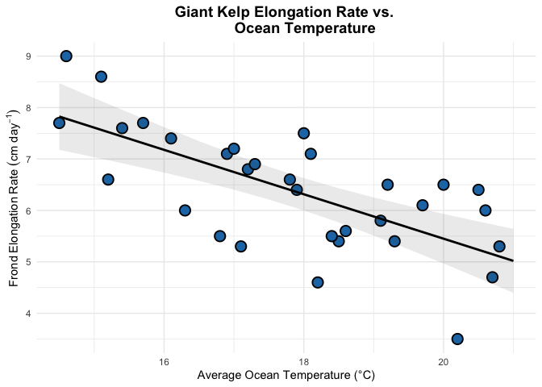
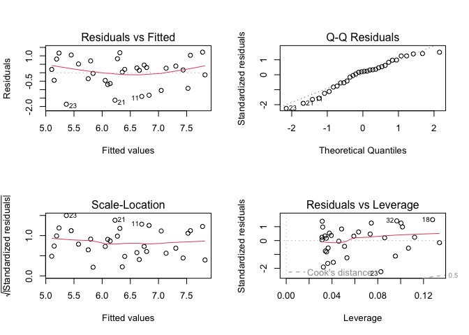
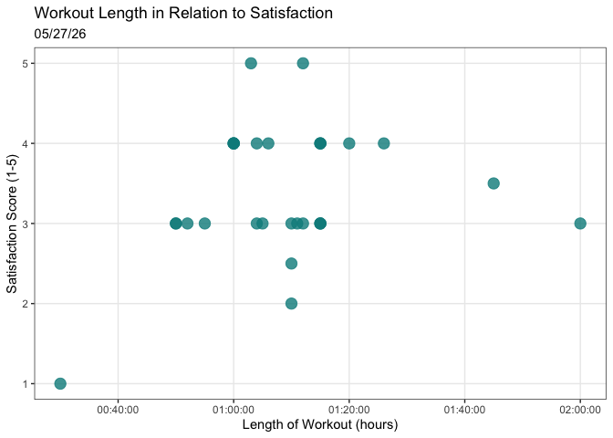
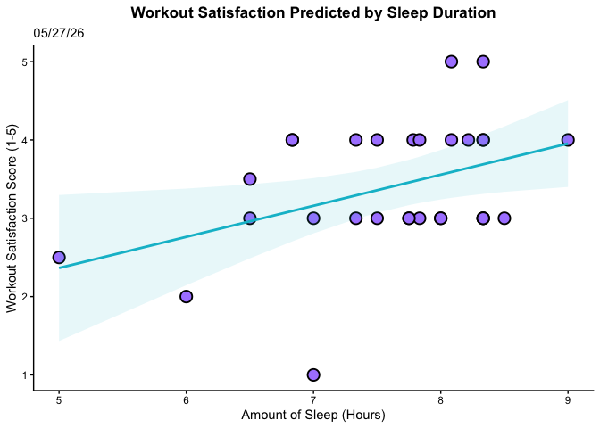
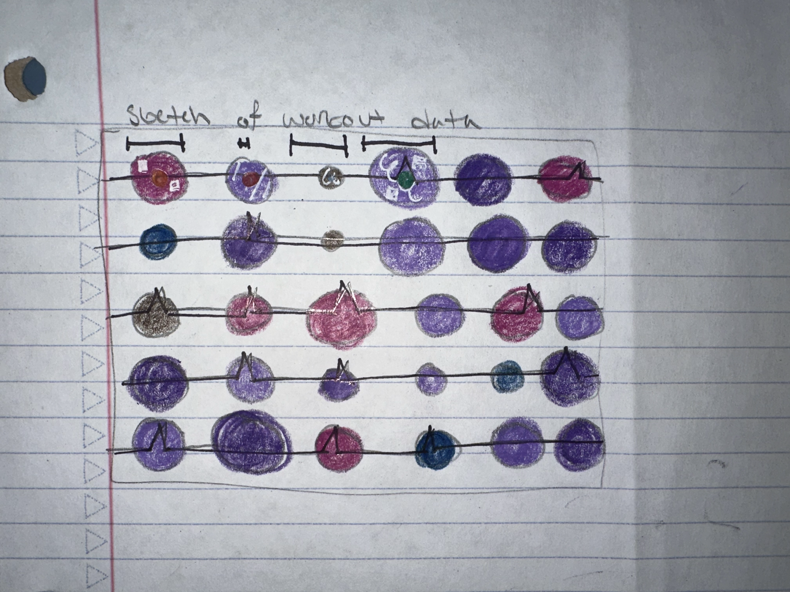
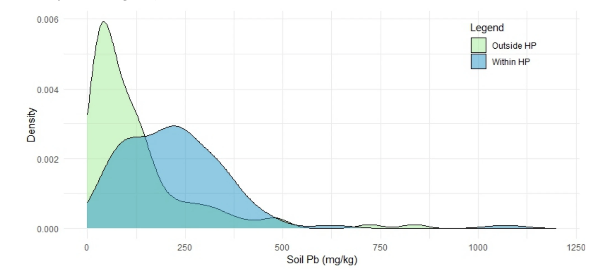

# Homework 3
Natalie Parker
2026-05-28

- [Set up](#set-up)
- [Problem 1](#problem-1)
  - [1a.](#1a)
  - [1b.](#1b)
  - [1c.](#1c)
    - [Checking assumptions](#checking-assumptions)
    - [Running test](#running-test)
  - [1d.](#1d)
  - [1e.](#1e)
  - [1f.](#1f)
- [Problem 2](#problem-2)
  - [2a.](#2a)
  - [2b.](#2b)
  - [2b.](#2b-1)
- [Problem 3](#problem-3)
  - [3a.](#3a)
  - [3b.](#3b)
  - [3c.](#3c)
  - [3d.](#3d)
  - [3e.](#3e)
- [Problem 4](#problem-4)
  - [4a.](#4a)
  - [4b.](#4b)
  - [4c.](#4c)
  - [4d.](#4d)

# Set up

``` r
library(tidyverse) # general use
library(janitor) # cleaning data frames
library(here) # file/folder organization
library(readxl) # reading .xlsx files
library(ggeffects)
# storing kelp data as object "kelp"
kelp <- read.csv(here("data", "temp-kelp.csv"))
# creating new object that fits a linear model to the data
kelp_model <- lm(
  kelp_elong ~ temp_c, 
  data = kelp)
# storing and cleaning personal data as object "personal_clean"
personal_clean <- read_csv(
  here("data", "ENVS 193DS- Personal Data - Sheet1.csv"), 
  # skipping the first 2 messed up rows
  skip = 2) |> 
  # dropping the first empty column
  select(-1) |> 
  # cleaning the names
  clean_names() |> 
 # converting sleep to a graphable value
  mutate(
    sleep_hours = 
      hour(hms(amount_of_sleep)) + (minute(hms(amount_of_sleep)) / 60),
    # converting the columns of "date", "caffeine", and "satisfaction" 
    # to numbers and dates
    date = as.Date(date, format = "%m/%d/%Y"),
    caffeine = as.numeric(caffeine),
    satisfaction = as.numeric(satisfaction))
```

# Problem 1

## 1a.

The appropriate tests would be the Pearson’s correlation and linear
regression to determine the strength of the relationship between giant
kelp frond elongation rate and temperature. Pearson’s correlation
measures the strength and the direction between the two variables.
Linear regression aims to describe a linear relationship between the
variables while being able to describe strength as well.

## 1b.

``` r
# creating new object called kelp_preds
kelp_preds <- ggpredict(
  kelp_model, 
  terms = "temp_c")
# base layer: ggplot with kelp data
ggplot(data = kelp, 
       aes (x = temp_c, # x-axis is sea temp
            y = kelp_elong)) + # y-axis is kelp elongation rate
  # first layer: geom_point to show underlying data
  geom_point(fill = "#1f78b4", # changing the color and size
             size = 4, 
             stroke = 1,
             shape = 21) + 
 # second layer: ribbon representing confidence interval
 # using predictions data frame
 geom_ribbon(data = kelp_preds,
             aes(x = x,
                 y = predicted, 
                 ymin = conf.low,
                 ymax = conf.high),
             alpha = 0.1) +
  # third layer: line representing model predictions
  geom_line(data = kelp_preds,
            aes(x = x,
                y = predicted),
            linewidth = 1)+
   labs ( x= "Average Ocean Temperature (°C)",
         y = bquote(Frond~Elongation~Rate~(cm~day^-1)),
                    title = "Giant Kelp Elongation Rate vs. 
         Ocean Temperature") +
  # changing the theme
  theme_minimal() +
  # customizing the look of the titles!
  theme(plot.title = element_text(face = "bold",
                                  size = 14, 
                                  hjust = 0.5),
        axis.title = element_text(face = "plain",
                                  size = 11))
```



## 1c.

### Checking assumptions

``` r
# base R residuals
par(mfrow = c(2,2))
plot(kelp_model)
```



When thinking about the relationship between ocean temperature and kelp
elongation, it would make sense for there to be a linear relationship.
We can see this in the residuals vs. fitted plot and the plotted data.
We can assume independent errors due to the independent observations and
data collection methods. The residual vs. fitted and scale location
plots both show us the homoscedasticity of errors. The plots show that
the data is homoscedastic because of the decently straight trend line.
Looking at the QQ plot seen in residual plots, the data seems to be
normally distributed. It roughly follows the straight line with
variations that are normal to see in real data.

I think I did ok checking the assumptions. It’s hard because making the
decision is subjective, but generally most math isn’t, and making the
“wrong” choice can have big impacts. The QQ plot was hardest to assess
due to the slight curve seen in it.

### Running test

``` r
# showing the output of linear regression
summary(kelp_model)
```


    Call:
    lm(formula = kelp_elong ~ temp_c, data = kelp)

    Residuals:
        Min      1Q  Median      3Q     Max 
    -1.8643 -0.5017  0.1790  0.5659  1.2177 

    Coefficients:
                Estimate Std. Error t value Pr(>|t|)    
    (Intercept) 14.08645    1.49219   9.440 1.72e-10 ***
    temp_c      -0.43179    0.08321  -5.189 1.37e-05 ***
    ---
    Signif. codes:  0 '***' 0.001 '**' 0.01 '*' 0.05 '.' 0.1 ' ' 1

    Residual standard error: 0.8665 on 30 degrees of freedom
    Multiple R-squared:  0.473, Adjusted R-squared:  0.4554 
    F-statistic: 26.93 on 1 and 30 DF,  p-value: 1.366e-05

## 1d.

To evaluate the strength of the relationship between temperature and
giant kelp frond elongation rate, I used an F test from a linear
regression model. I used the linear regression model because the data
met the assumptions for the model and the goal was to test the strength
of the relationship of the variables. A linear model is great for
testing strength and relationship. I used the f-test because it’s
traditional to get the output for an F-test when creating a linear
model.

We reject the null hypothesis, so the elongation rate of giant kelp
decreased as the average ocean temperature increased (linear regression,
F(30,1) = 26.93, R<sup>2</sup> = 0.473, p\< 0.001, $\alpha$ = 0.05)

Based on Model predictions, for each unit 1 increase in ocean
temperature, we expect an decrease of 0.43 $\pm$ 0.08 (SE) cm
day<sup>-1</sup>.

## 1e.

This test used the data collected from kelp in varying ocean
temperatures to understand how increasing ocean temperature can affect
giant kelp growth. From performing a F test for significance and a
linear regression model for strength of the relationship, we were able
to understand that when average ocean temp increases, we see a decrease
in giant kelp elongation. This means that for giant kelp to be at their
healthiest, ocean temperatures cannot continue to increase.

## 1f.

``` r
# creating new object for pearson's test from kelp data and running
# pearson's test
kelp_corr <- cor.test(kelp$temp_c, 
                      kelp$kelp_elong, 
                      method = "pearson")
# displaying test output
kelp_corr
```


        Pearson's product-moment correlation

    data:  kelp$temp_c and kelp$kelp_elong
    t = -5.189, df = 30, p-value = 1.366e-05
    alternative hypothesis: true correlation is not equal to 0
    95 percent confidence interval:
     -0.8359665 -0.4460157
    sample estimates:
           cor 
    -0.6877489 

Both tests would have lead to the exact same decision of rejecting the
null hypothesis because they have identical t-values of -5.189, p-values
of 1.366e-05, and the same significance level of 0.05. They also come to
the same conclusion for correlation and strength because of they have to
same regression coefficient (-0.688), which is equal to the R squared
value of 0.473 when squared. They both show a strong negative
correlation between increase in temp and kelp elongation.

# Problem 2

## 2a.

``` r
# base layer: ggplot
ggplot(data = personal_clean,
       # x-axis is length of wo, y-axis is satisfaction
       aes(x = length_of_wo,
           y = satisfaction)) +
  # first layer: point, points with a custom color
  geom_point(color = "cyan4", size = 4, alpha = 0.8) +
  # clean theme
  theme_bw() +
  # removing the excess grid marks
  theme(panel.grid.minor = element_blank())+
  # labels and title
  labs(
    x = "Length of Workout (hours)",
    y = "Satisfaction Score (1-5)",
    title = "Workout Length in Relation to Satisfaction",
    subtitle = "05/27/26")
```



## 2b.

Figure 2. Length of workout doesn’t influence satisfaction. Data
collected from workouts taken place in the time period 4-20-2026 to
5-27-2026 (Data accessed 05-28-2026). Teal points represent individual
observations of length of workout (hours) (total n = 30) plotted against
satisfaction with workout (1-5).

``` r
workout_model <- lm(satisfaction ~ sleep_hours, data = personal_clean)
personal_preds <- ggpredict(workout_model, 
                            terms = "sleep_hours")
#base layer: ggplot 
ggplot() +
  # second layer: geom_point to show underlying data with personal_clean data
  geom_point( data = personal_clean, 
       aes(x = sleep_hours, 
       y = satisfaction), 
       fill = "#ac88ff",
       size = 4,
       stroke = 1,
       shape = 21) +
  # third layer: geom_ribbon to show CI
 # using predictions data frame
 geom_ribbon(data = personal_preds,
             aes(x = x,
                 y = predicted, 
                 ymin = conf.low,
                 ymax = conf.high),
             fill = "#00bdd0",
             alpha = 0.1) +
  # third layer: line representing model predictions
  geom_line(data = personal_preds,
            aes(x = x,
                y = predicted),
            color = "#00bdd0",
            linewidth = 1) +
  # adding axes titles and titles!
  labs(
    x = "Amount of Sleep (Hours)",
    y = "Workout Satisfaction Score (1-5)",
    title = "Workout Satisfaction Predicted by Sleep Duration",
    subtitle = "05/27/26") +
  # changing theme
  theme_classic() +
  # removing grid lines, bolding title, and changing axes text
  theme(
    panel.grid.major = element_blank(),
    panel.grid.minor = element_blank(),
    plot.title = element_text(face = "bold", size = 13, hjust = 0.5),
    axis.title = element_text(face = "plain", size = 11))
```



## 2b.

Figure 3. Less sleep is associated with lower workout satisfaction. Data
collected from workouts taken place in the time period 4-20-2026 to
5-27-2026 (Data accessed 05-28-2026). Purple points represent individual
observations of amount fo sleep (hours) (total n = 30) plotted against
workout satisfaction score (1-5). Teal, thin line represent the linear
regression model prediction for workout satisfaction given amount of
sleep. Thick, transparent, teal stripe represents 95% confidence
interval of linear regression model.

# Problem 3

## 3a.

An affective visualization for my personal data could be done in a
variety of ways. My idea is to use circles to represent each workout.
The size of the circle is based on sleep, the color is based on
satisfaction, the type of workout would be some pattern or symbol on the
circle, and a handful of other features for the other variables. This
would work for my data because it has the ability to have lots of
different features, and my data collection has many different variables.

## 3b.



## 3c.

## 3d.

My piece is showing the stats that affect my workouts (amount of sleep,
type of workout, caffeine intake, etc.) and the satisfaction I feel
after the workout.

I found Lorraine Woodruff-Long visualization on global warming to be the
most inspiring. I like the idea of using a shape, levels of color, and
even size to demonstrate the data.

I will be doing a mixed media piece with watercolors, colored pencils,
and pens to make my piece. Using a variety of materials allows me to
showcase more variables.

I created this piece by brainstorming how to show many variables that
was in my artistic realm and used inspiration from Lorraine
Woodruff-Long. From their I decided to sketch on my paper the region for
each circle, make a color palette, and a potential key.

## 3e.

[Slides](https://docs.google.com/presentation/d/1wo8I9dZb1FMhUEOiI9nXgyw4GRF4ckBQ7vlfXtCfVe0/edit?slide=id.g3e55384c291_0_0#slide=id.g3e55384c291_0_0)

# Problem 4

## 4a.

The test for this paper is Mann- Whitney U. This test addresses the main
question of “if the lead contamination in neighborhoods in Huntington
Park are higher than other places in LA?” by showing a potential
significant difference using a p-value (p\<0.01). If there was a
significant difference seen, that means that the lead contamination in
Huntington Park would be higher than the surrounding areas. This test
works for this because they’re independent and not normally distributed.


## 4b.

The author could have been more clear with their visual statistics. The
x- and y- axes were chosen appropriately, but they don’t show any
underlying data, means or SE. I think it was wise to fill in the area
under the lines, considering this plot is looking at the concentration
density, but it lacks any other data visualization component. I don’t
feel like it’s misleading or under representative per-say, but it could
have been a little more descriptive.

## 4c.

The figure from part a does not have very much visual color. The legend
is small, there isn’t excess graph features, and the grid lines are
light in color. The data:ink ratio is intermediate. Having filled the
area under the curve, increases the ratio, but the colors are
transparent. Considering the information they’re communicating (lead
contamination density in soil), it makes sense to fill the area under
the curve.

## 4d.

This paper includes multiple figures, so there isn’t much I would
recommend changing. I think that showcasing the underlying data could be
helpful. We’ve been taught in this class to do that because it’s
important to see where exactly the figure came from with the individual
observations. I also think that they could have separated the plot into
two. Displaying the two plots (one with concentration density outside
HP, the other with concentration density within HP) side by side would
have been effective as well, and then there wouldn’t be any overlap in
data (which could confuse some viewers at first glance).
